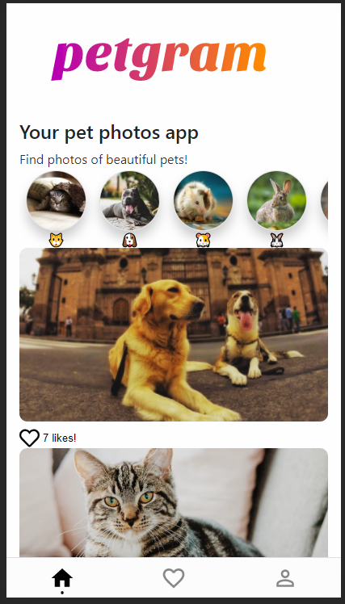

# App de Mascotas con ReactJS

App de mascotas con ReactJS utilizando hooks y React Context

[Ver la aplicación](https://curso-platzi-react-avanzado.andonig.now.sh/)

## ¿Cómo funciona?

Requiere Node.JS 14.2

-   `npm install` para instalar dependencias.
-   `npm run dev` para el entorno de desarrollo.

## Licencia

MIT
